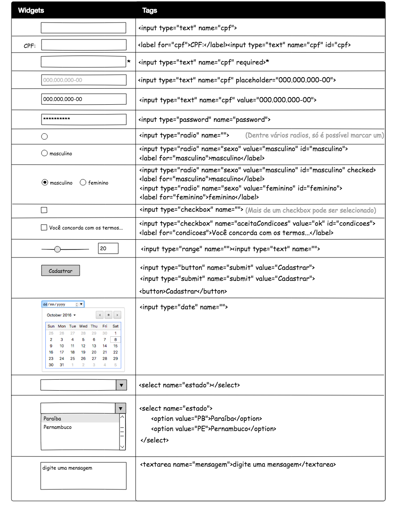

# HTML

## References

* HTML Awesome [](https://github.com/diegocard/awesome-html5)
* Portais: [W3C](https://www.w3.org/standards/webdesign/htmlcss), [MDN](https://developer.mozilla.org/en-US/docs/Web/HTML) e  [WP](https://docs.webplatform.org/wiki/html)
* Guias: [MDN](https://developer.mozilla.org/en-US/docs/Web/Guide/HTML) e [WP](https://docs.webplatform.org/wiki/html/tutorials)
* Versões: [Draft](https://w3c.github.io/html/), [5.1](https://www.w3.org/TR/html51/), [5](https://www.w3.org/TR/html5/), [4.01](https://www.w3.org/TR/html4/), [outras versões](https://www.w3.org/QA/2002/04/valid-dtd-list.html)
* HTML5: [Features](https://developer.mozilla.org/en-US/docs/Web/Guide/HTML/HTML5) e  [Demo](http://html5demos.com/)
* Form HTML: [html5doctor](http://html5doctor.com/html5-forms-introduction-and-new-attributes/), [W3C](https://www.w3.org/TR/html5/forms.html)

## Hello World

[`hello/index.html`](hello/index.html):
```html
<!DOCTYPE html>
<html lang="en">
<head>
  <meta charset="UTF-8">
  <title>Document</title>
</head>
<body>
  <p style="color:blue;font-size:20px;">Olá, mundo!</p>
</body>
</html>  
```

## HTML Entities

* Reference: W3C ([1](https://dev.w3.org/html5/html-author/charref) e [2](https://www.w3.org/TR/html51/syntax.html#named-character-references))

| Char | Description | Unicode |Entity Name | Entity Code (Hex) |  Entity Code (Dec) |
|-|-|-|-|-|-|
| ! | EXCLAMATION MARK | U+00021 | &amp;excl; | &amp;#x00021; | &amp;#33; |
| & | AMPERSAND | U+00026 | &amp;amp; &amp;AMP; | &amp;#x00026; | &amp;#38; |
| < | LESS-THAN SIGN | U+0003C | &amp;lt; &amp;LT; | &amp;#x0003C; | &amp;#60; |
| > | GREATER-THAN SIGN | U+0003E | &amp;gt; &amp;GT; | &amp;#x0003E; | &amp;#62; |
| © | COPYRIGHT SIGN | U+000A9 | &amp;copy; &amp;COPY; | &amp;#x000A9; | &amp;#169; |
| á | LATIN SMALL LETTER A WITH ACUTE | U+000E1 | &amp;aacute; | &amp;#x000E1; | &amp;#225;|

**Examples**

[`entity/index.html`](entity/index.html):
```html
<!DOCTYPE html>
<html lang="en">
<head>
  <meta charset="UTF-8">
  <meta name="viewport" content="width=device-width, initial-scale=1.0">
  <meta http-equiv="X-UA-Compatible" content="ie=edge">
  <title>Document</title>
</head>
<body>
  <!-- Exemplos de Entidades -->
  <p>Para criar um parágrafo em HTML é necessário usar a tag &lt;p>.</p>
  <p>A entidade &amp;lt; no HTML cria o caracter <.</p>
  <p>Para exibir o © no HTML usamos a entidade &amp;copy;.</p>
</body>
</html>
```

## HTML Attributes

* Reference: MDN([1](https://developer.mozilla.org/en-US/docs/Web/HTML/Attributes) e [2](https://developer.mozilla.org/en-US/docs/Web/HTML/Global_attributes)), [WP](https://docs.webplatform.org/wiki/html/attributes) e [W3C](https://www.w3.org/TR/2014/REC-html5-20141028/index.html)

## HTML Elements

* Reference: [MDN](https://developer.mozilla.org/en-US/docs/Web/HTML/Element), [WP](https://docs.webplatform.org/wiki/html/elements) e [W3C](https://www.w3.org/TR/2014/REC-html5-20141028/index.html) (tabela comparativa: [w3school](http://www.w3schools.com/tags/ref_html_dtd.asp), [triin](http://www.triin.net/temp/html-elements.html) )

* Folha de Resumo: [Websitesetup](https://websitesetup.org/html5-cheat-sheet/)

### <head>

* https://gethead.info

### <meta>

* [Favicon](https://en.wikipedia.org/wiki/Favicon)
* Robots.txt: [robots](http://www.robotstxt.org/robotstxt.html) e [robots do g1.com](http://g1.globo.com/robots.txt)

### 

* Reference: [MDN](https://developer.mozilla.org/en-US/docs/Web/HTML/Element/img)
* [Image Data URI](https://css-tricks.com/data-uris/)

# Examples

```

```

### `<table>`

- Tabela
  - Elementos: `<table>`, `<thead>`, `<tbody>`, `<tfoot>`, `<tr>`, `<th>`, `<td>`
  - Atributos: `border`, `colspan`, `rowspan`

### `<form>`

<!-- TODO convert img2md -->

