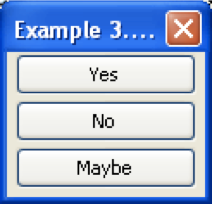

# Markup Language

## Problema

Styling ([`text.txt`](text.txt)):
```txt
Lorem ipsum dolor
Lorem ipsum dolor sit amet, consectetur adipisicing elit, sed do eiusmod tempor incididunt ut labore et dolore magna aliqua. Ut enim ad minim veniam, quis nostrud exercitation ullamco laboris nisi ut aliquip ex ea commodo consequat. Duis aute irure dolor in reprehenderit in voluptate velit esse cillum dolore eu fugiat nulla pariatur. Excepteur sint occaecat cupidatat non proident, sunt in culpa qui officia deserunt mollit anim id est laborum.
```

Output:
<div style="border-radius: 0.3rem;background-color: #f3f6fa;border: solid 1px #dce6f0;">
  <h1 style="color:#000">Lorem ipsum dolor</h1>
  <p><i>Lorem</i> ipsum <b>dolor</b> sit amet, consectetur adipisicing elit, sed do eiusmod tempor incididunt ut labore et dolore magna aliqua. Ut enim ad minim veniam, quis nostrud exercitation ullamco laboris nisi ut aliquip ex ea commodo consequat. Duis aute irure dolor in reprehenderit in voluptate velit esse cillum dolore eu fugiat nulla pariatur. Excepteur sint occaecat cupidatat non proident, sunt in culpa qui officia deserunt mollit anim id est laborum.</p>
</div>

### Markdown

Reference: [Sintax](https://daringfireball.net/projects/markdown/syntax), [Cheatsheet](https://github.com/adam-p/markdown-here/wiki/Markdown-Cheatsheet) e [vscode - markdown preview](https://code.visualstudio.com/docs/languages/markdown#_markdown-preview)

[`text.md`](text.md):
```md
# Lorem ipsum dolor

*Lorem* ipsum **dolor** sit amet, consectetur adipisicing elit, sed do eiusmod tempor incididunt ut labore et dolore magna aliqua. Ut enim ad minim veniam, quis nostrud exercitation ullamco laboris nisi ut aliquip ex ea commodo consequat. Duis aute irure dolor in reprehenderit in voluptate velit esse cillum dolore eu fugiat nulla pariatur. Excepteur sint occaecat cupidatat non proident, sunt in culpa qui officia deserunt mollit anim id est laborum.
```

### LaTeX

Reference: [Sintax](https://daringfireball.net/projects/markdown/syntax), [Cheatsheet](https://github.com/adam-p/markdown-here/wiki/Markdown-Cheatsheet) e [Editor](https://www.overleaf.com/9385056rmtvknmdwshj)

[`text.tex`](text.tex):
```tex
% https://www.overleaf.com/9385056rmtvknmdwshj

\documentclass{article}

\begin{document}

\section*{Lorem ipsum dolor}

\textit{Lorem} ipsum \textbf{dolor} sit amet, consectetur adipisicing elit, sed do eiusmod tempor incididunt ut labore et dolore magna aliqua. Ut enim ad minim veniam, quis nostrud exercitation ullamco laboris nisi ut aliquip ex ea commodo consequat. Duis aute irure dolor in reprehenderit in voluptate velit esse cillum dolore eu fugiat nulla pariatur. Excepteur sint occaecat cupidatat non proident, sunt in culpa qui officia deserunt mollit anim id est laborum.

\end{document}
```

### XML

Reference: [Sintax](https://www.w3.org/TR/xml/)

[`text.xml`](text.xml):
```xml
<texto>
  <titulo>Lorem ipsum dolor</titulo>
  <paragrafo><italico>Lorem</italico> ipsum <negrito>dolor</negrito> sit amet, consectetur adipisicing elit, sed do eiusmod tempor incididunt ut labore et dolore magna aliqua. Ut enim ad minim veniam, quis nostrud exercitation ullamco laboris nisi ut aliquip ex ea commodo consequat. Duis aute irure dolor in reprehenderit in voluptate velit esse cillum dolore eu fugiat nulla pariatur. Excepteur sint occaecat cupidatat non proident, sunt in culpa qui officia deserunt mollit anim id est laborum.</paragrafo>
</texto>
```

### HTML

Reference: [Sintax](https://www.w3.org/TR/html/)

[`text.html`](text.html):
```html
<h1>Lorem ipsum dolor</h1>
<p><i>Lorem</i> ipsum <b>dolor</b> sit amet, consectetur adipisicing elit, sed do eiusmod tempor incididunt ut labore et dolore magna aliqua. Ut enim ad minim veniam, quis nostrud exercitation ullamco laboris nisi ut aliquip ex ea commodo consequat. Duis aute irure dolor in reprehenderit in voluptate velit esse cillum dolore eu fugiat nulla pariatur. Excepteur sint occaecat cupidatat non proident, sunt in culpa qui officia deserunt mollit anim id est laborum.</p>
```

### Comparing

| estrutura | .md | .tex | .xml | .html |
|-|-|-|-|-|
| <h1>título</h1> | \# |  \section* | \<titulo> | \<h1> |
| parágrafo | quebra de linha | quebra de linha | \<titulo> | \<h1> |
| <i>itálico</i> | \* | \textit | \<italico> | \<i> |
| <b>negrito</b> | \** | \textbf | \<negrito> | \<b> |

## Others Markup Language

### SVG Image 

Reference: [Syntax](https://www.w3.org/Graphics/SVG/)

[`imagem.svg`](imagem.svg):
```xml
<svg version="1.1"
     baseProfile="full"
     width="300" height="200"
     xmlns="http://www.w3.org/2000/svg">
  <rect width="100%" height="100%" fill="red" />
  <circle cx="150" cy="100" r="80" fill="green" />
  <text x="150" y="125" font-size="60" text-anchor="middle" fill="white">SVG</text>
</svg>
```

Output:

<svg version="1.1"
     baseProfile="full"
     width="300" height="200"
     xmlns="http://www.w3.org/2000/svg">
  <rect width="100%" height="100%" fill="red" />
  <circle cx="150" cy="100" r="80" fill="green" />
  <text x="150" y="125" font-size="60" text-anchor="middle" fill="white">SVG</text>
</svg>

### XUL Interface 

Reference: [Syntax](https://developer.mozilla.org/en-US/docs/Mozilla/Tech/XUL)

[`interface.xul`](interface.xul):
```xml
<?xml version="1.0"?>
<?xml-stylesheet href="chrome://global/skin/"
type="text/css"?>
<window id="vbox example" title="Example 3...."
xmlns="http://www.mozilla.org/keymaster/gatekeeper/
there.is.only.xul">
  <vbox>
    <button id="yes1" label="Yes"/>
    <button id="no1" label="No"/>
    <button id="maybe1" label="Maybe"/>
  </vbox>
</window>
```

Outuput:



### MathML Expression 

Reference: [Syntax](https://www.w3.org/TR/MathML/)

[`mathml.xml`](mathml.xml):
```xml
<?xml version="1.0" encoding="UTF-8"?>
  <!DOCTYPE math PUBLIC
"-//W3C//DTD MathML 2.0//EN"
     "http://www.w3.org/Math/DTD/mathml2/mathml2.dtd">
  <math xmlns="http://www.w3.org/1998/Math/MathML">
    <mrow>
      <mi>a</mi>
      <mo>&InvisibleTimes;</mo>
      <msup>
        <mi>x</mi>
        <mn>2</mn>
      </msup>
      <mo>+</mo>
      <mi>b</mi>
      <mo>&InvisibleTimes; </mo>
      <mi>x</mi>
      <mo>+</mo>
      <mi>c</mi>
    </mrow>
  </math>
```

Outuput:


### KML Point 

Reference: [Syntax](http://www.opengeospatial.org/standards/kml/)

[`point.kml`](point.kml):
```xml
<?xml version="1.0" encoding="UTF-8"?>
<kml xmlns="http://www.opengis.net/kml/2.2">
<Document>
<Placemark>
  <name>New York City</name>
  <description>New York City</description>
  <Point>
    <coordinates>-74.006393,40.714172,0</coordinates>
  </Point>
</Placemark>
</Document>
</kml>
```

Outuput:


